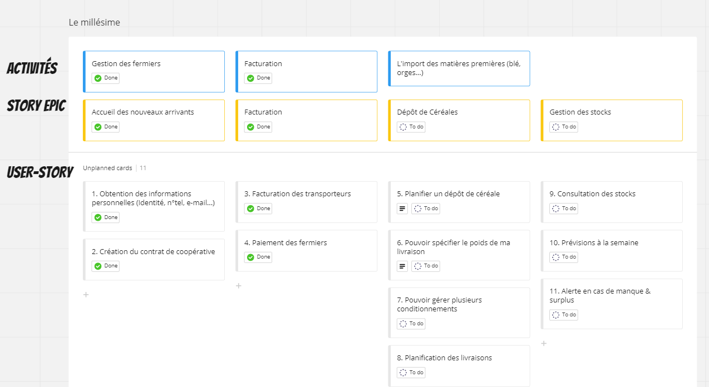
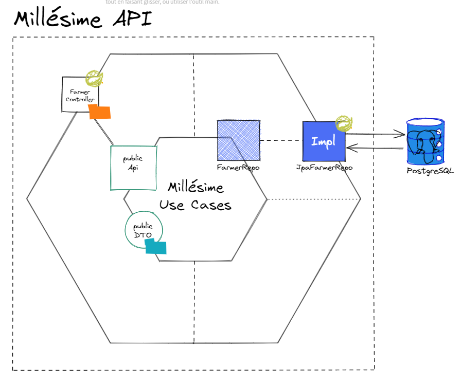

# Le millésime

Notre société est une coopérative céréalière.  
Pour être performant, nous avons besoin d'informatiser nos processus.

## Story mapping

Après un travail acharné avec la team Product Owner. Nous avons pu construire la story map suivante:



En découle des User stories que nous avons priorisées au courant des 2 sprints précédents.  
Ainsi, aujourd'hui vous arrivez au sein de l'équipe de développement avec comme objectif d'attaquer l'activité "Import des matières premières" et principalement les US 5 et 6.

Le backlog est prêt et n'attend que vous.

## Backlog
### 5. Planifier un dépôt de céréales

En tant que fermier membre de la coopérative,  
Je veux pouvoir planifier un dépôt de céréale à l'avance  
Pour avoir la confirmation que j'ai le droit de livrer à la date et heure convenu.  

 - [ ] Le fermier doit être un membre de la coopérative, sans ça il ne peut pas utiliser l'api.  
 - [ ] Le fermier doit choisir une date dans le futur avec au moins 7 jours d'avance.  
 - [ ] Le fermier doit choisir parmi une liste de 4 céréales : 
      * Blé
      * Avoine
      * Orge
      * Houblon

### 6. Pouvoir spécifier le poids de ma livraison
En tant que fermier membre de la coop  
Je veux pouvoir spécifier le poids de ma cargaison au moment où je la planifie,  
Afin que la coop puisse prendre une décision et confirmer que ma livraison est possible.  

Au moment où le fermier précise son choix de céréales à livrer, il doit désormais préciser une quantité.  
 - [ ] Cette quantité doit être un nombre en tonnes, un entier positif à 2 décimales.
 - [ ] Cette quantité ne peut être inférieure à 1,5t et supérieur à 8t

## Technique

### Présentation

En tant que membre de l'équipe de développement, vous aurez sûrement besoin d'avoir les informations sur la stack technique et l'architecture du projet.

L'architecture applicative se résume pour l'heure à un ensemble d'API.  
La facturation a été isolée sur un microservice dédié et ne fera donc pas l'objet de votre périmètre technique.  

Les périmètres fonctionnels "Gestion des fermiers" et "Import des matières premières" sont rassemblés au sein du même dépôt de code qui permet de déployer un microservice exposant des API REST.

L'architecture technique choisie pour ce microservice est [l'architecture hexagonale](https://blog.ippon.fr/2021/02/17/spring-boot-hexagone/) :


Concernant la stack technique, voici la liste des langages et frameworks utilisés :
* Java 17
* Springboot 2.7.6


Il a aussi été choisi de faire du "Contrat First" pour la gestion des contrats d'API.
Le dossier [api-contracts](./api-contracts) contient les contrats au format OpenAPI.

### Lancer l'application en local

Si vous le souhaitez, vous pouvez lancer l'application en local mais elle nécessite une base de données PostgreSQL.  
Mais heureusement, nous avons un docker-compose.yml disponible avec la bonne configuration :
```shell
docker compose up -d
```

Il suffit alors de lancer via Maven l'application spring-boot :
```shell
./mvnw spring-boot:run
```
dupertuys dupertuys


